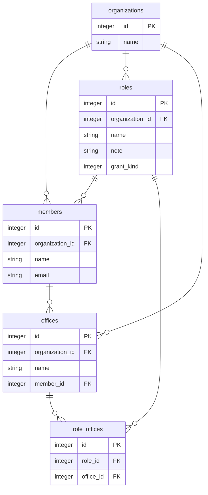

## 制限事項
- ""の外では英語以外は使用できない
- 属性にコメントを付けるとGithub上では表示に失敗する
- Github上では表示が崩れる
- 変更中をどう表現するか（gitで履歴管理されるのでそもそもする必要あるか）
- コンフリクトがどれほど発生するかは懸念点

## ドキュメント
[ドキュメント](https://mermaid-js.github.io/mermaid/#/)
